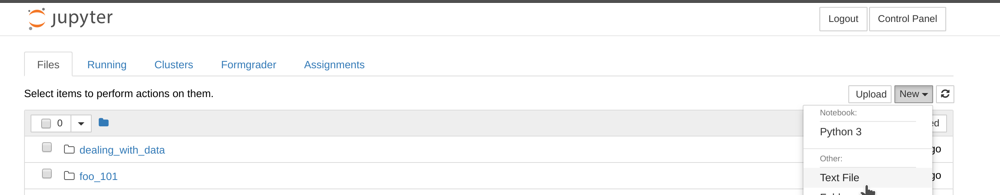
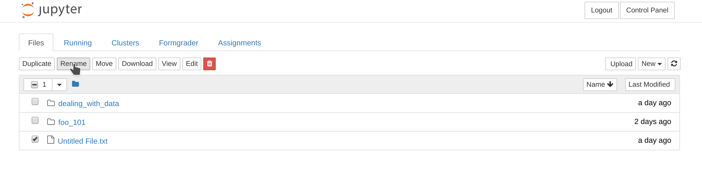

This is the Class Tools infrastructure specification and management tools.

- [Prerequisites](#prerequisites)
- [Download the repository](#download-the-repository)
- [Building the Docker images](#building-the-docker-images)
  - [Build the base image](#build-the-base-image)
  - [Build the notebook image](#build-the-notebook-image)
  - [Build the database image](#build-the-database-image)
  - [Build the hub image](#build-the-hub-image)
- [Setup JupyterHub on your Kubernetes cluster](#setup-jupyterhub-on-gce)
  - [Configure Helm](#configure-helm)
  - [Reserve a static IP address](#reserve-a-static-ip-address)
  - [Install an Ingress controller](#install-an-ingress-controller)
  - [Install kube-lego](#install-kube-lego)
  - [Install JupyterHub](#install-jupyterhub)
  - [Access the service](#access-the-service)
  - [Update the configuration](#update-the-configuration)
  - [Set Up an NFS Server](#set-up-an-nfs-server)
- [Configure Formgrader](#configure-formgrader)
- [Remove JupyterHub](#remove-jupyterhub)
- [Reference](#reference)

### Prerequisites

Make sure you have installed

- [Docker](https://www.docker.com/) >= *17.x.x*
- [Google Cloud SDK](https://cloud.google.com/sdk/)
- [kubectl](https://kubernetes.io/docs/user-guide/kubectl/)
- [Helm](https://github.com/kubernetes/helm) >= *2.7.2*

### Download the repository

Run

```bash
git clone --recurse-submodules https://github.com/ipeirotis/docker
```

in a folder of your choice.

### Building the Docker images

Before building any of the Docker images, two environment variables need to be specified:

* `DOCKER_REGISTRY` : the registry and repository to push the images, e.g. `me/my-docker-hub-repo`,
* `IMG_VERSION` : the suffix to append to each image. Each tag will be in the form `name-IMG_VERSION`. Defaults to *latest*.

#### Build the base image

To build and push the base scientific library image to the docker repository specified above, run

```bash
make push-base
```

in the project's root directory.

You can also run

```bash
make build-base
```

to just build the docker image locally.

#### Build the notebook image

To build and push the single-user Jupyter Notebook image that will be spawned on Kubernetes, run:

```bash
make push-kubernetes-su
```

in the project's root directory.

You can also run

```bash
make build-kubernetes-su
```

to just build the docker image locally.

There is also a single-user server Docker image that can be executed locally, or within a GCP Container Engine/
AWS ECS instance.

To build this version, run:

```bash
make push-local-su
```

#### Build the database image

In Kubernetes, the singleuser notebook servers are spawned as pods with two containers:
- a MySQL database container
- the actual notebook server container

To build and push the database image, run:

```bash
make push-db
```

in the project's root directory.

You can also run

```bash
make build-db
```

to just build the docker image locally.

#### Build the hub image

To build and push the hub image, which has LDAPAuthenticator installed, run

```bash
git clone https://github.com/abenetopoulos/zero-to-jupyterhub-k8s
cd zero-to-jupyterhub-k8s/images/hub
docker build -f Dockerfile -t ${DOCKER_REGISTRY}:hub-${IMG_VERSION} .
docker push ${DOCKER_REGISTRY}:hub-${IMG_VERSION}
```

in a folder of your choice.

To use this version of the hub, you will have to change the value of the `hub.image` entry in
`deployment/helm/jupyterhub/values.yaml` to match the image you just uploaded, and then update your own version of the
helm chart to a public helm repository. You can use a Google Cloud bucket to store your public helm repository (see [[2]](#reference)
for instructions on how to create a public storage bucket). Once you have updated the `values.yaml` file, run:

```bash
./update_chart.sh bucket_name
```

from the `deployment/helm` directory, where `bucket_name` is the name of the Google Cloud bucket that will host the helm repository.

### Setup JupyterHub on GCE

#### Configure Helm

- Initialise Tiller, Helm's in-cluster server.

    ```bash
    kubectl --namespace kube-system create sa tiller
    kubectl create clusterrolebinding tiller --clusterrole cluster-admin --serviceaccount=kube-system:tiller
    helm init --service-account tiller
    ```

    **Note**: The second command should be executed only if the Kubernetes cluster is RBAC-enabled. If you created the cluster from the GCE console, it not enabled by default.

- Add the Google Cloud bucket, to which you [uploaded the helm chart earlier](#build-the-hub-image), as a helm repository:

    ```bash
    helm repo add jupyterhub https://NAME_OF_BUCKET.storage.googleapis.com/
    helm repo update
    ```

#### Reserve a static IP address

- Go to the [Reserve a static address page](https://console.cloud.google.com/networking/addresses/add) in the GCP Console.
- Select the relevant project that contains the Kubernetes cluster.
- Choose a name for the new address.
- Specify that it is an IPv4 regional address and select the same region as your Kubernetes cluster.
- Click Reserve to reserve the IP.

#### Install an Ingress controller

- Configure the chart

    ```bash
    cp deployment/helm/ingress.yaml.example deployment/helm/ingress.yaml
    ```

    and set `controller.service.loadBalancerIP` to the reserved static IP address.

- Install the controller.

    ```bash
    helm install --name=INGRESS-RELEASE-NAME stable/nginx-ingress -f deployment/helm/ingress.yaml
    ```

where `--name` is a deployment identifier used by Helm.

#### Install kube-lego

[kube-lego](https://github.com/jetstack/kube-lego) is used for automatic provisioning of HTTPS certificates from [Let's Encrypt](https://letsencrypt.org/).
- Configure `kube-lego`:

    ```bash
    cp deployment/helm/lego.yaml.example deployment/helm/lego.yaml
    ```

    and set :
    * `config.LEGO_EMAIL` to the email address you would like to use for the certificate registration with Let's Encrypt.
    * `config.LEGO_URL` to a Let's Encrypt API endpoint. `https://acme-staging.api.letsencrypt.org/directory` for staging environments, and
      `https://acme-v01.api.letsencrypt.org/directory` for production environments.
- Install `kube-lego`:
    ```bash
    helm install --name=LEGO-RELEASE-NAME stable/kube-lego -f deployment/helm/lego.yaml
    ```

#### Install JupyterHub

- Configure the chart

    ```bash
    cp deployment/helm/config.yaml.example deployment/helm/config.yaml
    ```

    and set the following parameters:

    - `proxy.secretToken`: Quoting from [[1]](#reference):

        > A 64-byte cryptographically secure randomly generated string used to secure communications between the hub and the configurable-http-proxy.
        >
        > This must be generated with `openssl rand -hex 32`.
        >
        > Changing this value will cause the proxy and hub pods to restart. It is good security practice to rotate these values over time. If this secret leaks, immediately change it to something else, or user data can be compromised

    - `hub.cookieSecret`: Quoting from [[1]](#reference):

        > A 64-byte cryptographically secure randomly generated string used to sign values of secure cookies set by the hub.
        >
        > [...]
        >
        > This must be generated with `openssl rand -hex 32`.
        >
        > Changing this value will all user logins to be invalidated. If this secret leaks, immediately change it to something else, or user data can be compromised

    - `hub.extraConfig`: Additional configuration parameters for JupyterHub
       - `LDAPAuthenticator`: Configuration for LDAP authentication
         - `LDAPAuthenticator.server_address`: The hostname of your LDAP server
         - `LDAPAuthenticator.bind_dn_template`: Distinguished name format for your server's users
         - `LDAPAuthenticator.use_ssl`: Omit if your LDAP server does not make use of SSL
         - `Kubespawner.singleuser_extra_containers`: Set the image name of the 'db' container to match the database image [you built earlier](#build-the-database-image)

       - `Authenticator.admin_users`: The set of JupyterHub users who will have administrator access. This should be the
       list of instructors.

       - `Kubespawner.singleuser_extra_containers`: The set of extra containers that run in the same pod as the
       singleuser servers. You will have to update the `Kubespawner.singleuser_extra_containers[0].image` to match
       the database image you uploaded in a previous step, as well as the `MYSQL_ROOT_PASSWORD` environment
       variable.

    - `singleuser.image`: The docker image you built during the first phase of the setup process.
      - `singleuser.image.name`: The repository in which the image is hosted.
      - `singleuser.image.tag`: The tag of the target notebook image.

    - `ingress.hosts`: The list of domains that should be routed to the hub.
    - `ingress.tls.hosts`: List of hosts to include in the TLS certificate.
    - `ingress.tls.secretName`: The name of the secret used to terminate SSL traffic on 443.

  For more configuration options, see [[1]](#reference).

- Add a label to one of the cluster's nodes.

  To avoid service disruptions caused by hub reallocations during cluster scaling, we will assign the hub pod to a specific
  node in the cluster. To do this, we will generate a label and assign it to one of the nodes.

  Run

  ```bash
  kubectl get nodes
  ```

  in a terminal. The output should look like this:

  ```bash
  gke-high-mem-default-pool-54b459ae-g4pk   Ready    [ ... ]
  gke-high-mem-default-pool-54b459ae-gcwm   Ready    [ ... ]
  gke-high-mem-default-pool-54b459ae-mltx   Ready    [ ... ]
  gke-high-mem-default-pool-54b459ae-t64n   Ready    [ ... ]
  ```

  Pick one of the nodes, and run

  ```bash
  kubectl label nodes node_name hub-node=true
  ```

  where `node_name` is the identifier of the node you would like to assign the hub to. For instance, if we wanted to assign the
  pod to the second node in the example above, we would run

  ```bash
  kubectl label nodes gke-high-mem-default-pool-54b459ae-t64n hub-node=true
  ```

- Install JupyterHub.

    ```bash
    helm install jupyterhub/jupyterhub --version=v0.6 \
        --name=RELEASE-NAME --namespace=NAMESPACE-NAME \
        -f deployment/helm/config.yaml [--set=rbac.enabled=false]
    ```

    where

    - `--name` is a deployment identifier used by Helm
    - `--namespace` is the name of the namespace in which JupyterHub will be deployed. If it does not exist, it will
    be created for you.

    **Note**: If the cluster you are deploying to is not RBAC-enabled, then you need to also use the `--set` flag
    in the above command.

  Check the status of the deployment.

  ```bash
  kubectl get pods --namespace NAMESPACE-NAME
  ```

  When both the proxy and the hub pods have a status of 'Running', the service is available.

#### Set Up an NFS Server

An NFS server is required for nbgrader to work. To deploy one, run the following commands:

```bash
make NAMESPACE=NAMESPACE-NAME deploy-nfs-server
```

where NAMESPACE-NAME is the namespace you deployed JupyterHub to in the previous step.


#### Access the service

Set the A record of your specified domain to the reserved static IP.
You will be able to access JupyterHub via **http://DOMAIN_NAME**.

Additionally, the service is exposed by its ephemeral IP. Run

```bash
kubectl get services --namespace NAMESPACE-NAME
```

and locate the EXTERNAL-IP of the **proxy-public** service, e.g.

```
NAME           CLUSTER-IP      EXTERNAL-IP     PORT(S)                      AGE
hub            10.39.250.207   <none>          8081/TCP                     5d
proxy-api      10.39.248.33    <none>          8001/TCP                     5d
proxy-http     10.39.247.51    <none>          8000/TCP                     5d
proxy-public   10.39.250.124   104.154.22.70   80:30456/TCP,443:32737/TCP   5d
```

You will be able to access JupyterHub directly from this IP on the standard HTTP and HTTPS ports.

#### Update the configuration

Update `config.yaml` and upgrade the installation.

```bash
helm upgrade RELEASE-NAME jupyterhub/jupyterhub --version=v0.5 -f deployment/helm/config.yaml [--set=rbac.enabled=false]
```

### Configure Formgrader

By default, all users have access to all course assignments. Instructors also have access to Formgrader. If you are an instructor, you need
to create a `nbgrader_config.py` file inside Jupyter's directory. Click on the top right hand corner where it says 'New', and select 'Text File' from
the drop-down menu.



An editor will launch in a new browser tab. Copy the contents of the sample file `nbgrader_instructor.py.example` and paste them into
the new file being edited. Change the placeholders for `c.Exchange.course_id` and `c.CourseDirectory.root` to match your course. Once you've made the
desirable changes, click `File > Save`, and return to the previous tab. Click on the check-box next to your new file, and select `Rename`.



Change the file's
name to `nbgrader_config.py`. Once that's done, you have to restart your server for the changes to take effect. Click on `Control Panel`, and then `Stop My Server`.
Wait for the `Stop My Server` button to disappear, before clicking on the `My Server` button. You should be able to navigate to the Formgrader tab, and see
all assignment files for the course you specified.

If in the future you wish to select a different course to access through Formgrader, you will have to change the values of `c.Exchange.course_id` and
`c.CourseDirectory.root`, and then restart your server.

### Remove JupyterHub

- Remove the JupyterHub installation.

```bash
helm del --purge RELEASE-NAME
```

- Remove the Ingress controller.

```bash
helm del --purge INGRESS-RELEASE-NAME
```
- Remove `kube-lego`.

```bash
helm del --purge LEGO-RELEASE-NAME
```

- Release the static IP address from the [GCE console](https://console.cloud.google.com/networking/addresses/list).

- Remove the NFS server.

```bash
make NAMESPACE=NAMESPACE-NAME teardown-nfs-server
```

### Reference

[1] [Helm Chart Configuration](https://zero-to-jupyterhub.readthedocs.io/en/latest/reference.html#id1)

[2] [How to make a public Google Cloud Storage Bucket](https://github.com/kubernetes/helm/blob/master/docs/chart_repository.md#google-cloud-storage)
